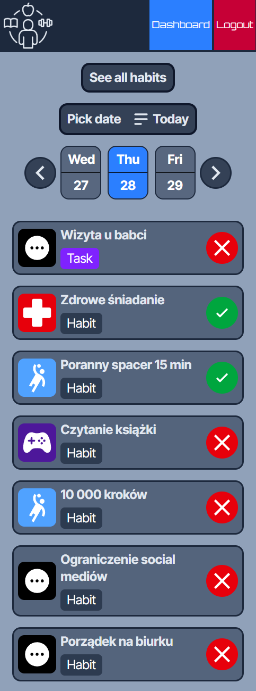
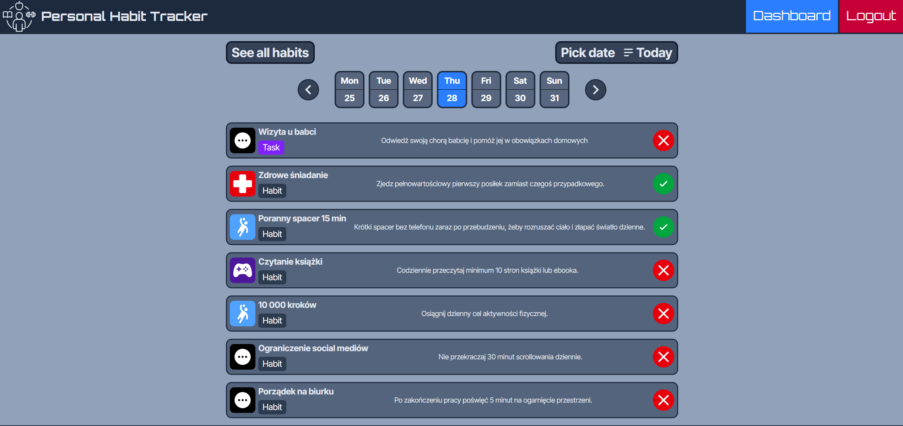
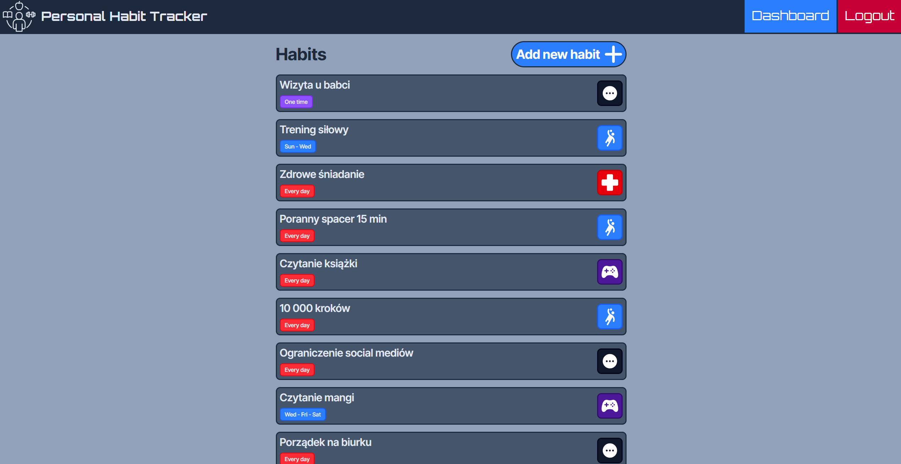
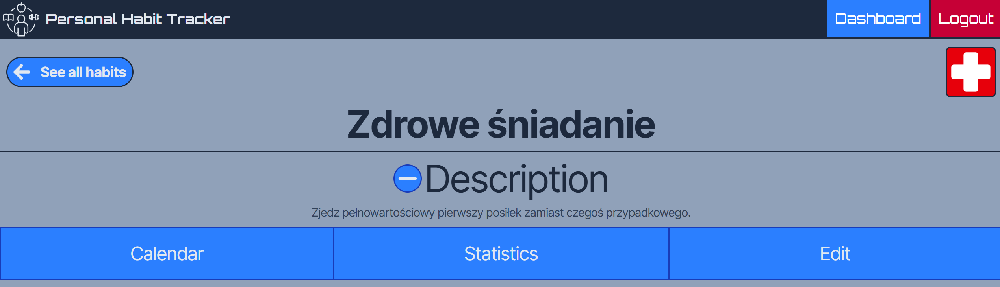
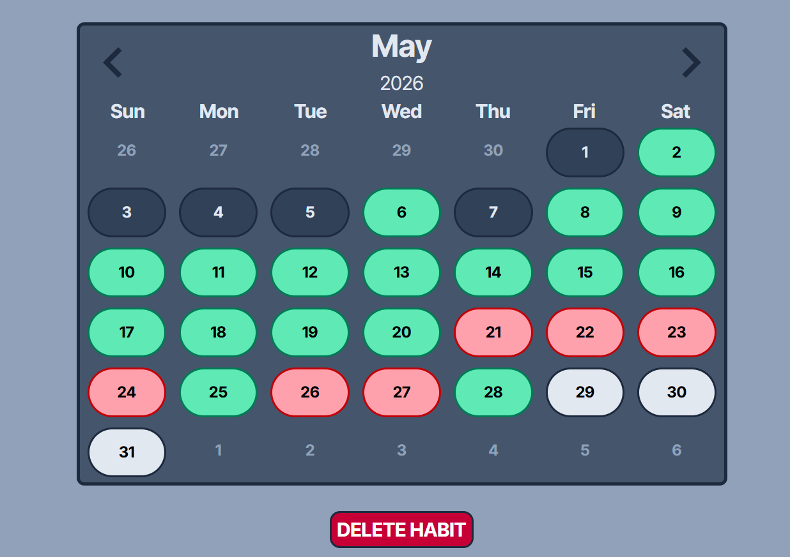
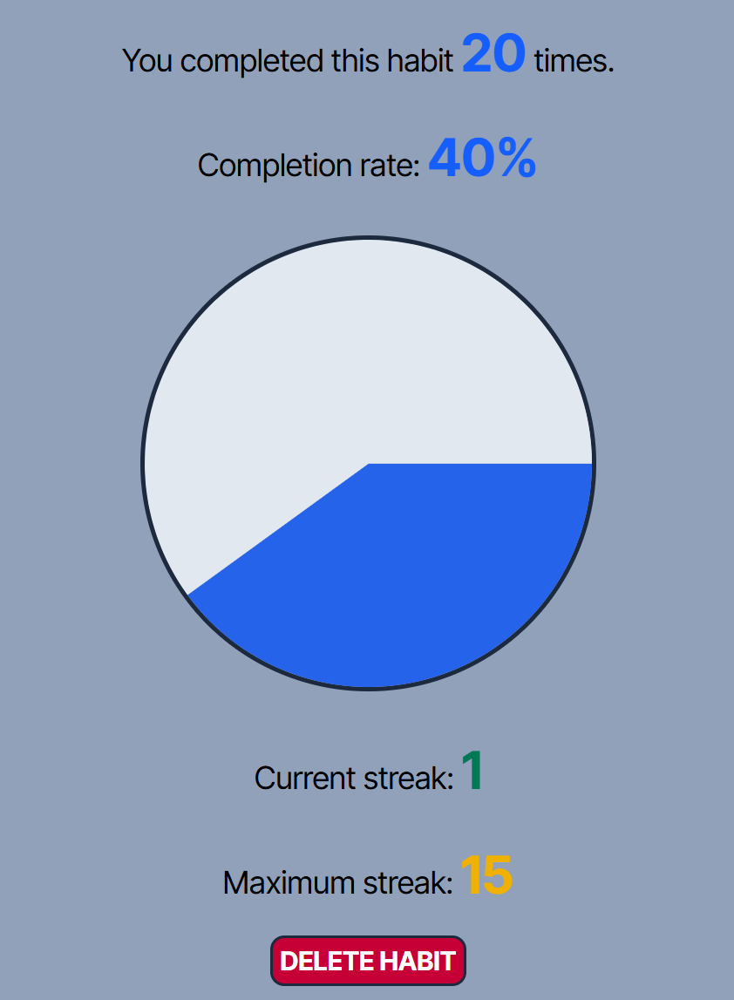
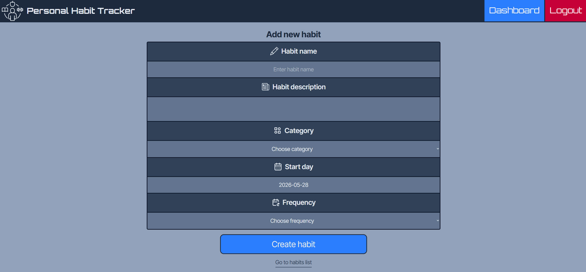

# PERSONAL HABIT TRACKER 

A web application for tracking daily habits, allowing users to create, manage and monitor their habits with calendar view and statistics

---

## Deployed app
https://personal-habit-tracker-ko.onrender.com/

## Test accounts
**WARNING:** Use local demo accounts only in the local environment and hosted demo accounts only in the hosted environment. Using them across environments may cause unexpected errors or data inconsistencies.

### Hosted test account:
email: test-host@gmail.com

password: Asdfghjkl;

### Local test account:
email: test2@gmail.com

password: Asdfghjkl;

## Features

- User authentication (register/login)
- Create, edit and delete habits
- Different habit types: 
    - Daily - should be completed every day
    - Weekly - should be completed on selected days of the week (e.g. Monday, Friday)
    - One-time task - can be completed on any day
- Dashboard page displays habits for a selected date from the calendar. 
  Users can mark habits as completed or not completed.
  Users can check future or past dates.
- Habits page displaying all habits created by the user
- Single habit page displaying details about habit: 
  - Statistics:
    - Total completions
    - Completion rate
    - Current streak
    - Maximum streak
  - Calendar where users can:
    - Click on date to mark habit as completed or not completed
    - See which dates are available for completion and which are not
- Responsive design

## Tech Stack

### Frontend
- React
- Tailwind CSS

### Backend
- Node.js
- Express

### Database
- MongoDB
- Mongoose

### Auth
- JWT

## Local setup

### Backend
1. Create .env file in backend directory
2. Copy .env.example file content and paste it to .env
3. Create MongoDB database (e.g. MongoDB Atlas) and get connection string
4. Fill environment variables in .env file with your own values 
5. Open terminal
6. Type:
  ```bash
  cd backend
  npm install
  npm run dev
  ```

### Frontend
1. Create .env file in frontend directory
2. Copy .env.example file content and paste it to .env
3. Fill environment variables in .env file with your own values 
4. Open terminal
5. Type:
  ```bash
  cd frontend
  npm install
  npm run dev
  ```
## Responsive design

The application is fully responsive and optimized for desktop and mobile devices

### Mobile view (Dashboard)


## Screenshots

### Dashboard


### Habits Page


### Single Habit Page Top View


### Single Habit Page Calendar


### Single Habit Page Statistics


### Create Habit
